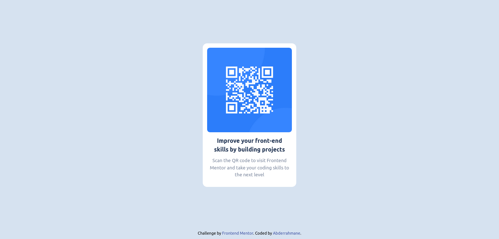

# Frontend Mentor - QR code component solution

This is a solution to the [QR code component challenge on Frontend Mentor](https://www.frontendmentor.io/challenges/qr-code-component-iux_sIO_H). Frontend Mentor challenges help you improve your coding skills by building realistic projects. 

## Table of contents

- [Frontend Mentor - QR code component solution](#frontend-mentor---qr-code-component-solution)
  - [Table of contents](#table-of-contents)
  - [Overview](#overview)
    - [Screenshot](#screenshot)
    - [Links](#links)
  - [My process](#my-process)
    - [Built with](#built-with)
  - [Author](#author)

## Overview

### Screenshot

### Links

- Solution URL: [github repo](https://github.com/ais-sam/Frontend-Mentor-Challenges/tree/main/-%20Challenge%2003%20-Qr-code-component)
- Live Site URL: [https://qr-code-component-3.netlify.app/](https://qr-code-component-3.netlify.app/)

## My process

### Built with

- Semantic HTML5 markup
- Tailwind CSS

## Author

- Frontend Mentor - [@ais-sam](https://www.frontendmentor.io/profile/ais-sam)

